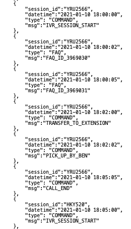
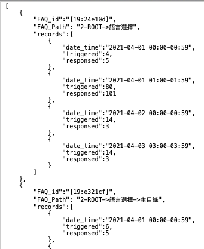
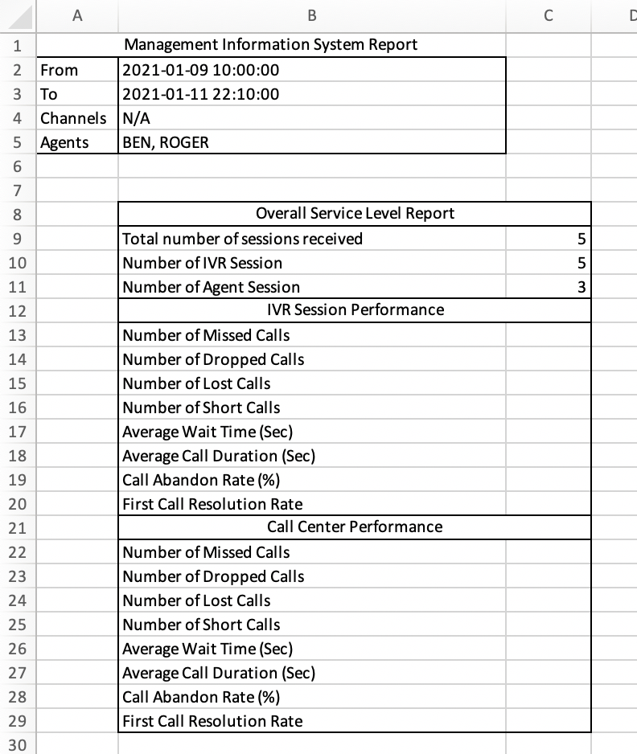
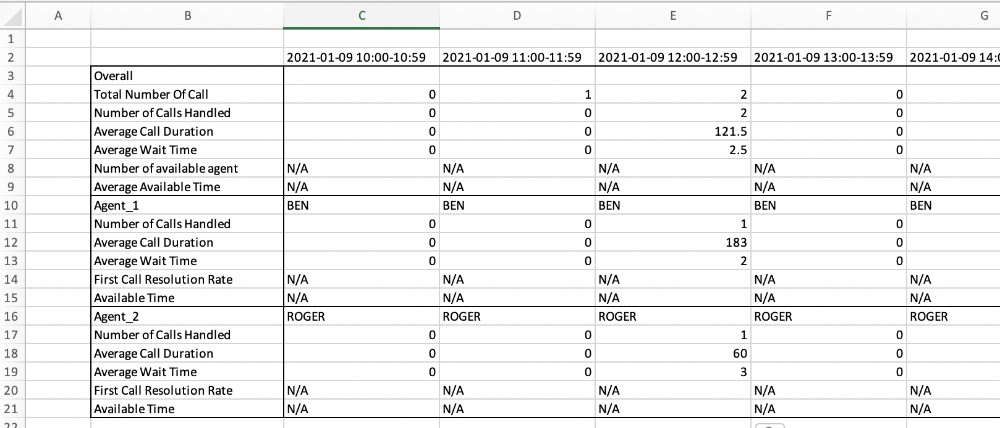
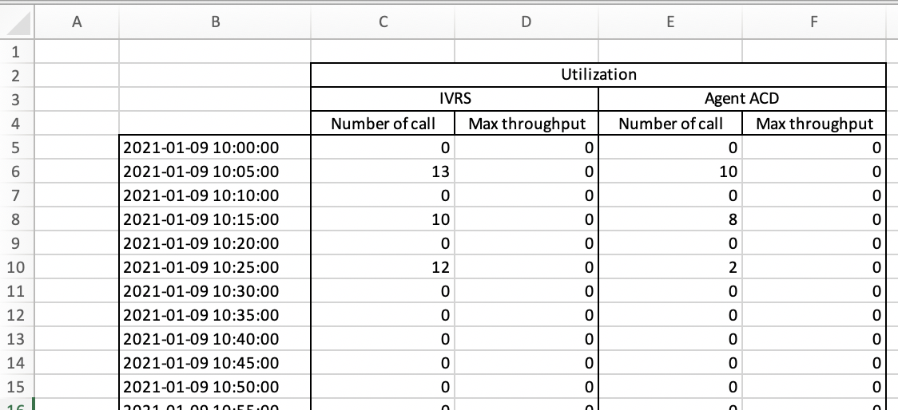
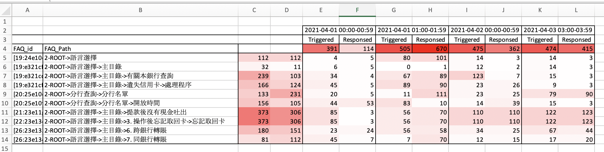

# Objectives
Generate a Management Information System Report in Microsoft Excel given two data files 

- one records SESSION details consists of start time, end time, agent name, call picking up time, etc.

- one records details of each FAQ being triggered and responsed by each interval (1 hour)

4 sheets are created:
- Overall sheet - summarise Total number of sessions received, Number of IVR Session, Number of Agent Session, agent names, report begining time and ending time.

- Agent Performance sheet - Calculate and display details of agents' performance by Number of Calls Handled, Average Call Duration, Average Call Wait Time by  interval of 1 hour in a date scope.

- Utilization sheet - Calculate and display Number of Call for both IVR and Agent ACD handled by interval of 5 mins in a date scope.

- FAQ sheet: display data in a heatmap which could be regarded as using color-coding to represent different values.

# Features
- support Command line to execute the script by passing necessary arguments

- heatmap support 3 colors: red (default), green, blue
- set borders to a group of cells
- create sheets 
- set titles to sheets
- set width for column
- merge cells
- set alignment
- fill cells with color
- set font to cells
- set value to cells

# Design
- reformatted data based on those from json files and load into memory, data is reformatted by session ID.
- create all necessary column names and row names for all sheets,
- set broders to groups of cells to readability

- FOR heatmap, calculate all sum and derive the color level so as to apply color to cells based on the values
- For other statistic, calculate and sum up data by date and time, allocate data to cells based on the date and time.

# Fundamental Excel components

### create workbook
wb = Workbook()

### create sheet
statistic_ws = wb.create_sheet()

### set border
cell.border = Border(top=thin, left=thin, right=thin, bottom=thin)

### set borfer for a group of cells
set_border(statistic_ws,'A5:B10')

### set width for column
statistic_ws.column_dimensions['A'].width = 8.43

### get column letter by value
column_letter_left = get_column_letter(1)   // column A

### merge cells
statistic_ws.merge_cells('A2:B2')

### set value to cell
statistic_ws['A2'].value = "cell content"

### set horizontal, vertical alignment
self.statistic_ws['A2'].alignment = Alignment(horizontal="center", vertical="center")

### fill cell with color
tatistic_ws['A4'].fill  = PatternFill("solid", fgColor=color)

### set font
ws[cell].font = Font(name=fontname, size=size, bold=bold)

# automate-data-visualization-in-Excel
